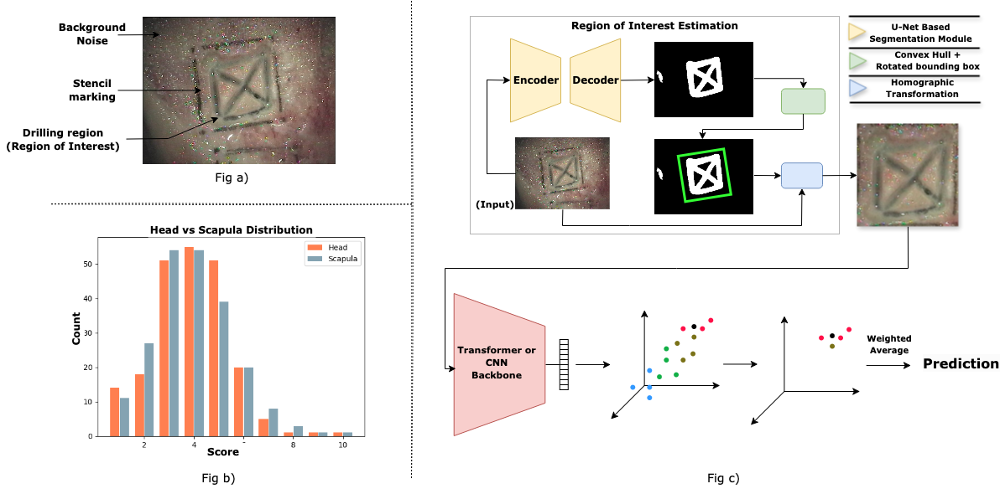

# 🧠 Microscopic Neuro-Drilling Skills Evaluation

This repository contains the source code and usage instructions for the deep learning-based framework proposed in the research titled:

**"A Deep Learning Approach for Objective Evaluation of Microscopic Neuro-Drilling Craniotomy Skills"**

## 📌 Overview

This work presents the **first well-annotated dataset** and a deep learning pipeline for **automated skill evaluation** of microscopic neuro-drilling, a critical component of neurosurgical training. The framework:
- Frames skill evaluation as a **rank estimation** task.
- Introduces a **geometric-order learning loss** to improve feature separability.
- Incorporates a **Unet-based segmentation module** to isolate the **region-of-interest (ROI)** for accurate assessment.
- Outperforms traditional regression/classification approaches and even human experts on multiple metrics.

## Framework

## 🧪 Methodology Summary

- **Data**: 435 final-task images scored on a 10-point Likert scale by neurosurgeons.
- **ROI Preprocessing**: Unet-based segmentation → convex hull → minimum area rectangle → homography correction.
- **Modeling**: Feature embeddings trained with directional, distance, and center losses to ensure order-preserving representations.
- **Evaluation**:  
  - Metrics: MAE, MSE, ±1 accuracy, Separability Index (SI±1)
  - Baselines: Regression and classification with CNN/Transformer models
  - Result: Up to **95.17% ±1 accuracy**, surpassing **human evaluator accuracy (87.74%)**
 
## 🚀 Getting Started

### Dataset
The dataset can be downloaded from [Micro-Drilling dataset](https://www.aiimsnets.org/research_neurotechnology.asp)

### Prerequisites
- Python 3.8+
- PyTorch
- OpenCV, NumPy, scikit-learn
- tqdm, matplotlib
more instructions comming soon..

## 📌 Acknowledgements

This work is supported by:
- **Indian Council of Medical Research (ICMR)**
- **BIRAC-PACE Grant, Department of Biotechnology (DBT), Government of India**
